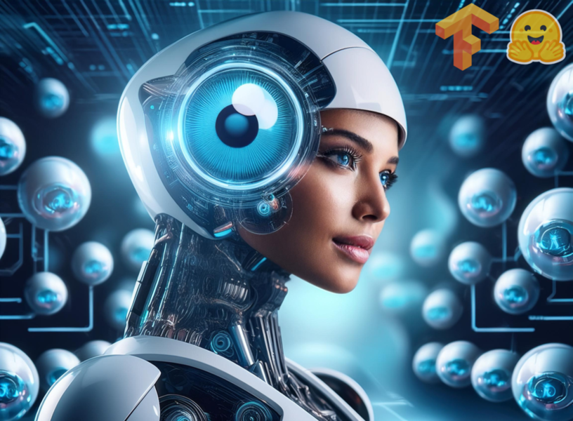
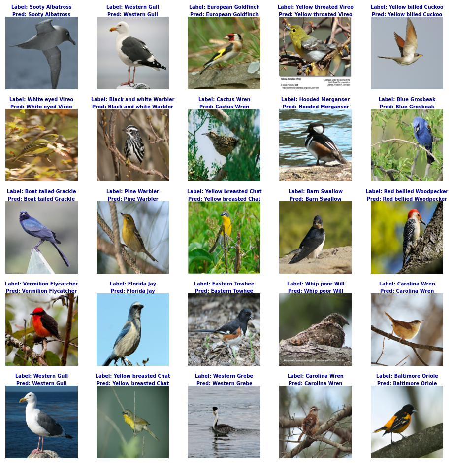
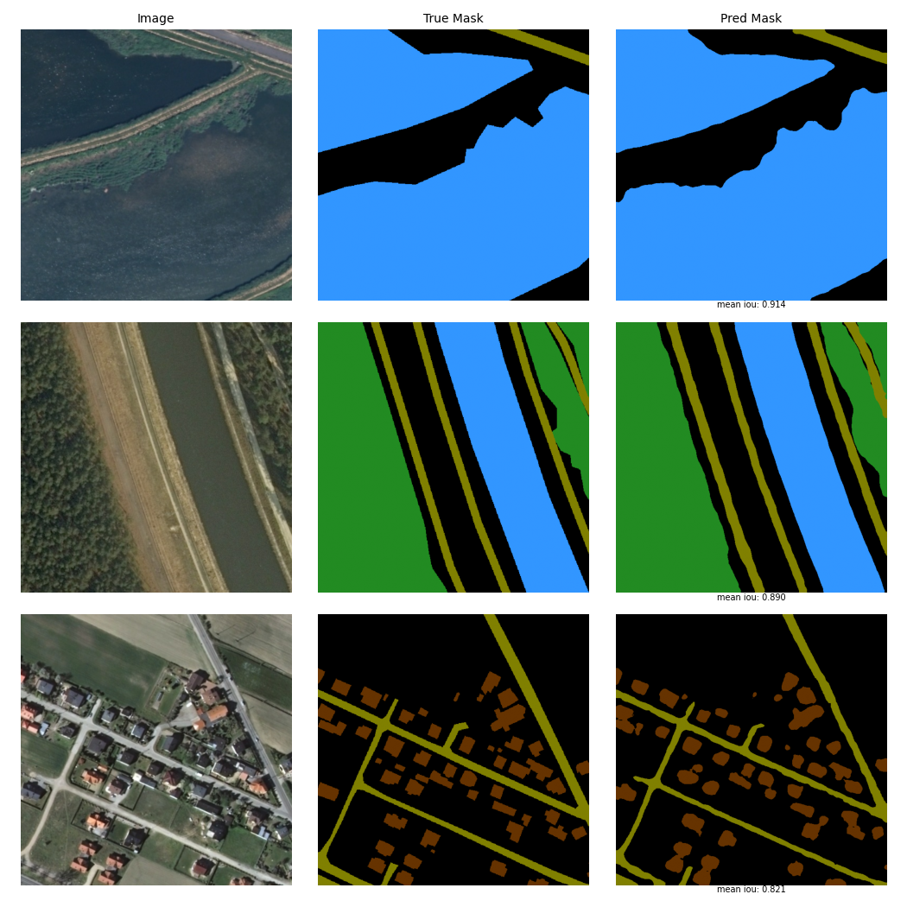

# <h1 align="center">**Computer Vision**</h1>

 

Computer Vision is a dynamic branch of artificial intelligence that empowers machines to interpret and analyze images and videos. It employs sophisticated algorithms and deep learning models to execute a variety of tasks including object recognition, action detection, image segmentation, and even scene reconstruction and pose estimation enabling systems to identify patterns and anomalies accurately. Today, computer vision is foundational in diverse applications ranging from autonomous vehicles and medical diagnostics to surveillance, augmented reality, and robotics, continuously evolving to transform how we interact with and understand the visual world.

## **Implemented Computer Vision Tasks**

This repository contains a collection of links to my projects that demonstrate implementations of Computer Vision models in Python. It includes several basic models built from scratch using [Convolutional Neural Networks (CNNs)](https://developers.google.com/machine-learning/glossary/#convolutional_neural_network). CNNs are a type of neural network designed to process data with a grid-like structure, such as images, and are particularly effective at recognizing visual patterns by capturing local features through convolution operations.

The repository also includes models that use [Transfer Learning](https://www.tensorflow.org/tutorials/images/transfer_learning), a technique that reuses high-performance models such as [Vision Transformers (ViT)](https://huggingface.co/docs/transformers/model_doc/vit) and [YOLO11](https://docs.ultralytics.com/es/models/yolo11/) pretrained on large datasets. This allows achieving high performance with lower computational costs. Transfer Learning takes advantage of the knowledge acquired by models trained on millions of images or videos and applies it to new, specific tasks, improving both efficiency and accuracy.

The following are the Computer Vision tasks I have implemented so far:

1. **[Image Classification](https://github.com/JersonGB22/ImageClassification-TensorFlow):** This task involves assigning a label or class to a whole image. The input consists of pixel values that make up an image, whether in grayscale or RGB, and the goal is to predict the class to which the image belongs.

  
   
  <em><small>Fine-Grained Image Classification on the CUB-200-2011 Dataset using ConvNeXt V2</small></em>

---

2. **[Object Detection](https://github.com/JersonGB22/ObjectDetection-TensorFlow-PyTorch):** Object detection models identify and locate instances of objects, such as cars, people, buildings, animals, etc., in images or videos. They return bounding box coordinates along with class labels and confidence scores for each detected object.

  
   
  <em><small>Oriented Object Detection on the DIOR-R Dataset using YOLO11-obb</small></em>

---

3. **[Image Segmentation](https://github.com/JersonGB22/ImageSegmentation-TensorFlow-PyTorch):** Image segmentation classifies each pixel in an image into a category or a specific instance of a category. This task is divided into three types:

   - **Semantic Segmentation:** Assigns a class label to each pixel in an image without distinguishing between different instances of the same class.

   

     
      
     <em><small>Semantic Segmentation on the LandCover.ai Dataset using SegFormer</small></em>
   

   ---
   
   - **Instance Segmentation:** Goes beyond Object Detection by labeling each pixel that belongs to a detected object with a specific class and instance. In this way, the models not only provide the coordinates of the bounding box, along with class labels and confidence scores, but also generate binary masks for each detected instance in an image.

   

     
      
     <em><small>Instance Segmentation on the BDD100K Dataset using YOLO11-seg</small></em>
   

   ---

   - **Panoptic Segmentation:** Combines semantic segmentation and instance segmentation by assigning each pixel in an image both a class and an instance label. This allows for a detailed segmentation of complex scenes.

   

     
      
     <em><small>Panoptic Segmentation on the LaRS Dataset using Mask2Former</small></em>
   

   ---

4. **[Pose Estimation](https://github.com/JersonGB22/PoseEstimation-TensorFlow-PyTorch):** This task enables machines to infer the position and orientation of humans, animals, or objects in images and videos by detecting specific points, commonly known as *keypoints* or *landmarks*. These points can represent joints, limbs, facial features, or other distinctive parts.

  
   
  <em><small>Multi-Species Animal Pose Estimation on the AP-10K Dataset using YOLO11-pose</small></em>

## **Contributions**

Contributions to this repository are welcome. If you have any questions or suggestions, please do not hesitate to contact me.

## **Technological Stack**
 

[![Ultralytics](https://img.shields.io/badge/Ultralytics-1572B6?style=for-the-badge&logo=data:image/svg+xml;base64,PHN2ZyB4bWxucz0iaHR0cDovL3d3dy53My5vcmcvMjAwMC9zdmciIGZpbGw9Im5vbmUiIHZpZXdCb3g9IjAgMCAyNTIgMjY0IiBoZWlnaHQ9IjI2NCIgd2lkdGg9IjI1MiI+CjxnIGNsaXAtcGF0aD0idXJsKCNjbGlwMF8xMDA4Xzk0MTc3KSI+CjxtYXNrIGhlaWdodD0iMjU4IiB3aWR0aD0iMjU0IiB5PSI2IiB4PSItMSIgbWFza1VuaXRzPSJ1c2VyU3BhY2VPblVzZSIgc3R5bGU9Im1hc2stdHlwZTpsdW1pbmFuY2UiIGlkPSJtYXNrMF8xMDA4Xzk0MTc3Ij4KPHBhdGggZmlsbD0id2hpdGUiIGQ9Ik0yNTIuMzkxIDYuMDY3ODFILTAuNDM3NVYyNjMuOTMySDI1Mi4zOTFWNi4wNjc4MVoiPjwvcGF0aD4KPC9tYXNrPgo8ZyBtYXNrPSJ1cmwoI21hc2swXzEwMDhfOTQxNzcpIj4KPHBhdGggZmlsbD0iIzBCMjNBOSIgZD0iTTU4Ljc1IDYuMDY4NTFDMjYuMTEzNiA2LjA2ODUxIC0wLjQzNzUgMzIuNjMxOCAtMC40Mzc1IDY1LjI4MjlDLTAuNDM3NSA5Ny45MzE0IDI2LjExMzYgMTI0LjQ5NiA1OC43NSAxMjQuNDk2QzkxLjM4NyAxMjQuNDk2IDExNy45MzggOTcuOTMxNCAxMTcuOTM4IDY1LjI4MjlDMTE3LjkzOCAzMi42MzE4IDkxLjM4NyA2LjA2ODUxIDU4Ljc1IDYuMDY4NTFaIj48L3BhdGg+CjxwYXRoIGZpbGw9IiMwQjIzQTkiIGQ9Ik0xMjUuNzE5IDE5MS40ODlDMTA0LjM5OSAxOTEuNDg5IDg0LjI1NDIgMTg2LjA4OCA2Ni41NzAzIDE3Ni42MDZWMjAzLjQ3MUM2Ni41NzAzIDIzNi4wNzEgOTIuNTg5OSAyNjMuMTIxIDEyNS4xNzUgMjYzLjQzNkMxNTguMDc4IDI2My43NTQgMTg0Ljk0NyAyMzcuMDY5IDE4NC45NDcgMjA0LjIyNlYxNzYuNTgxQzE2Ny4yNDcgMTg2LjA4NyAxNDcuMDY5IDE5MS40ODkgMTI1LjcxOSAxOTEuNDg5WiI+PC9wYXRoPgo8cGF0aCBmaWxsPSJ1cmwoI3BhaW50MF9saW5lYXJfMTAwOF85NDE3NykiIGQ9Ik0xMzMuNDY2IDY1LjI4OTVDMTMzLjQwNSAxMDYuNDgxIDk5Ljk3OTYgMTM5LjkzNCA1OC42NTg0IDE0MC4wMzVDNDIuNzE4NSAxNDAuMDc2IDI3Ljc2MDcgMTM1LjExMiAxNS41NTQ3IDEyNi40NDVDMzcuMTg4OCAxNjUuMTM0IDc4LjQ3MDEgMTkxLjUxNCAxMjUuNjczIDE5MS40MjNDMTk0LjI0MyAxOTEuNDc3IDI1MC44MjMgMTM1LjYyNiAyNTEuOTY2IDY3LjEyNTNMMjUxLjgwNCA2Ni45Nzg3QzI1MS44NzEgNjUuMjcxOSAyNTEuNzg4IDY2LjY3IDI1MS44NzEgNjUuMjcxOUMyNTEuOTA0IDMyLjU5OCAyMjUuMzEyIDUuOTMxMDEgMTkyLjgxNSA2LjA0NDc3QzE2MC4wMDggNi4xNzQzMiAxMzMuNDk5IDMyLjYxNTIgMTMzLjQ2NiA2NS4yODk1WiI+PC9wYXRoPgo8L2c+CjwvZz4KPGRlZnM+CjxsaW5lYXJHcmFkaWVudCBncmFkaWVudFVuaXRzPSJ1c2VyU3BhY2VPblVzZSIgeTI9IjI3LjA1MjciIHgyPSIyMTcuNzA4IiB5MT0iMTg5LjMyOCIgeDE9IjcxLjE1NTIiIGlkPSJwYWludDBfbGluZWFyXzEwMDhfOTQxNzciPgo8c3RvcCBzdG9wLWNvbG9yPSIjMDlEQkYwIj48L3N0b3A+CjxzdG9wIHN0b3AtY29sb3I9IiMwQjIzQTkiIG9mZnNldD0iMSI+PC9zdG9wPgo8L2xpbmVhckdyYWRpZW50Pgo8Y2xpcFBhdGggaWQ9ImNsaXAwXzEwMDhfOTQxNzciPgo8cmVjdCBmaWxsPSJ3aGl0ZSIgaGVpZ2h0PSIyNjQiIHdpZHRoPSIyNTIiPjwvcmVjdD4KPC9jbGlwUGF0aD4KPC9kZWZzPgo8L3N2Zz4K&logoColor=white&labelColor=101010)](https://docs.ultralytics.com/)

## **Contact**

